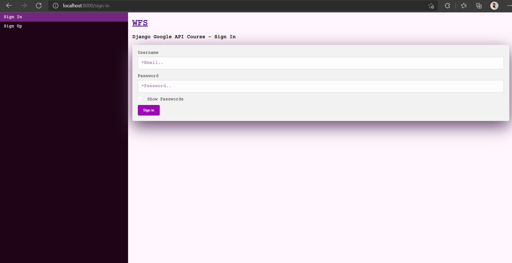

<p align="center">
  <blockquote>
    <h3>Django using Google`s API</h3>
  </blockquote>
</p>

<p align="center">
  <a href="https://github.com/WellingtonFidelis">
    
  </a>

  

  

  
</p>

<p align="center">
  
</p>

# :pushpin: Tabela de conteúdos

* [Sobre o projeto](#satisfied-sobre-o-projeto)
* [Layout](#panda_face-layout)
* [Tecnologias](#snowflake-tecnologias)
* [Como rodar o projeto](#question-como-rodar-o-projeto)
* [Autor](#closed_book-autor)

---
# :satisfied: Sobre o projeto
This project was made to study Django with use of other APIs, without intern API.
Acknowledgments to [freeCodeCamp](https://www.youtube.com/c/Freecodecamp).

---
# :panda_face: Layout
* [Pure CSS](https://developer.mozilla.org/pt-BR/docs/Web/CSS)

---
# :snowflake: Tecnologias
* [Python](https://www.python.org/)
* [Django](https://www.djangoproject.com/)
* [Google Cloud](https://cloud.google.com/)
* [Google reCAPTCHA](https://www.google.com/recaptcha/about/)
* [Docker](https://www.docker.com/)

---
# :question: Como rodar o projeto
## Acessando direto pelo site:
* Ainda não consegui deixar online. =/

## Rodando na máquina local:
(certifique-se de ter instalado na sua máquina o [Docker](https://www.docker.com/) e o [Docker Compose](https://docs.docker.com/compose/install/))
1. Abra o terminal na pasta desejada para clonar o repositório e execute o comando:
``` bash
git clone https://github.com/WellingtonFidelis/django-google-apis.git
```
1. Depois de concluído, execute os seguintes comandos para seguir para o caminho do app:
``` bash
cd django-google-apis/app-e-commerce-django
```
Para criar a imagem e deixar o app online:
``` bash
docker-compose up --build
```
Acessando o web app, abra o navegador e digite:
* http://localhost:8000/

---
# :closed_book: Autor
Feito por [Wellington Fidelis](https://github.com/WellingtonFidelis).
### :octocat: Github: https://github.com/WellingtonFidelis
### :link: LinkedIn: https://www.linkedin.com/in/wellington-fidelis-7b02b167/
### :camera: Instagram: https://www.instagram.com/wellingtonfidelis/